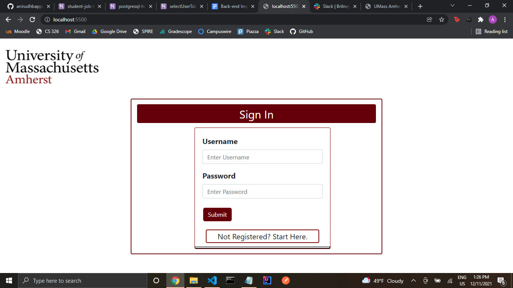

https://student-job-board-tet.herokuapp.com/

Title: 
Team Tet

Subtitle: 
student-job-board-tet

Semester: 
Fall 2021

Overview: 
This application was meant to be a portal for students to log in to in order to get results of a job best suited for their needs and wants whether it is on campus or off campus. The student would have been able to set their profile in order to quick apply to a job that they are interested in by having an automatically filled form that would take the information from the profile of the student and send it to the employer.

Team Members: 
Anjali Arigela -- aarigela9 
Ariel S. Lutati  -- ariel42700
Anirudh Tale -- anirudhbappu

User Interface: 
1. Login -- The first page is a login page. This page is where the student will be able to enter their information, or if they do not have user credentials already, they will have the option to register.
 
2. If you click on the register prompt, another page will be rendered where the student will be able to enter their credentials that they want and if they are available, they will be redirected to the login, else they will have to enter different credentials.
3. The main search page is where the student can select which options they like and based on the query that is generated from these options, a popup will show up.
4. The Job Results popup shows all the jobs that will show a table of all the jobs generated from the search. The student will be able to click on the link in order to get whatever job they clicked's full description.
5. The Job Description Page includes all the information about a specific given job.
6. There is also a profile page in which student profiles will show up in a popup.

APIs: A final up-to-date list/table describing your application’s API
Database: A final up-to-date representation of your database including a brief description of each of the entities in your data model and their relationships if any.
URL Routes/Mappings: A final up-to-date table of all the URL routes that your application supports and a short description of what those routes are used for. You should also indicate any authentication and permissions on those routes.
Authentication/Authorization: A final up-to-date description of how users are authenticated and any permissions for specific users (if any) that you used in your application. You should mention how they relate to which UI views are accessible.
Division of Labor: A breakdown of the division of labor for each team member — that is, saying who did what, for the entire project. Remember that everyone is expected to contribute roughly equally to each phase of the project. We expect to see similar numbers and kinds of GitHub commits by each student.
Conclusion: A conclusion describing your team’s experience in working on this project. This should include what you learned through the design and implementation process, the difficulties you encountered, what your team would have liked to know before starting the project that would have helped you later, and any other technical hurdles that your team encountered.