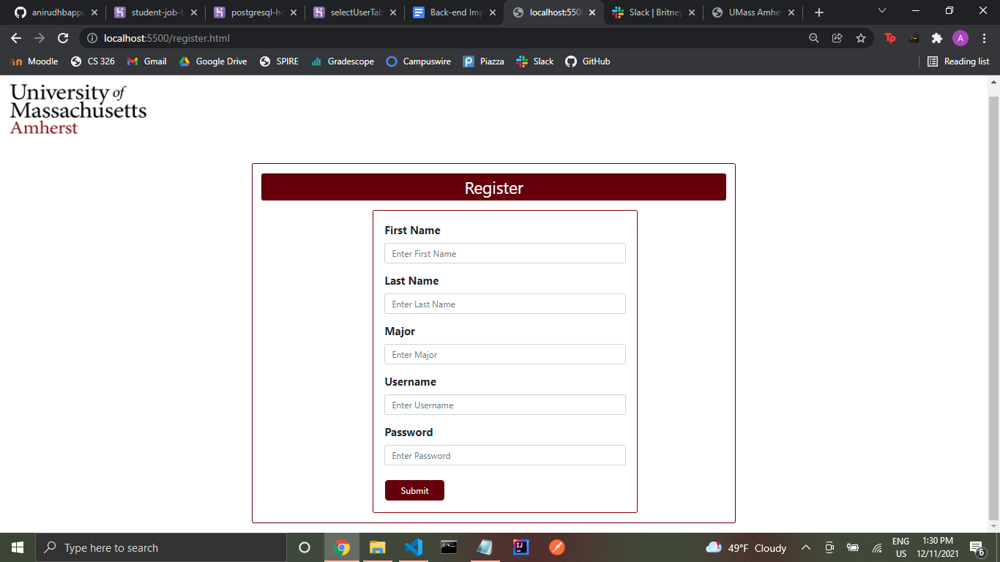
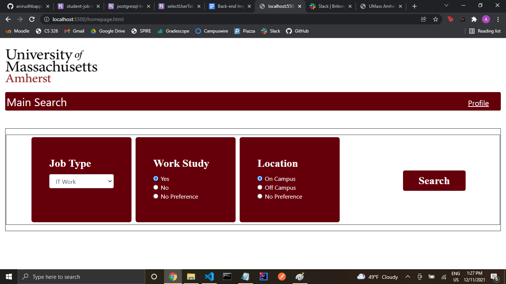
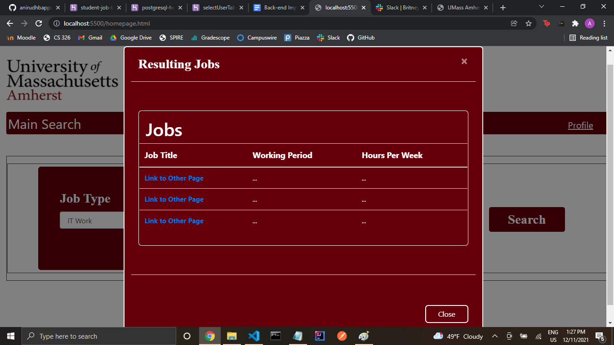
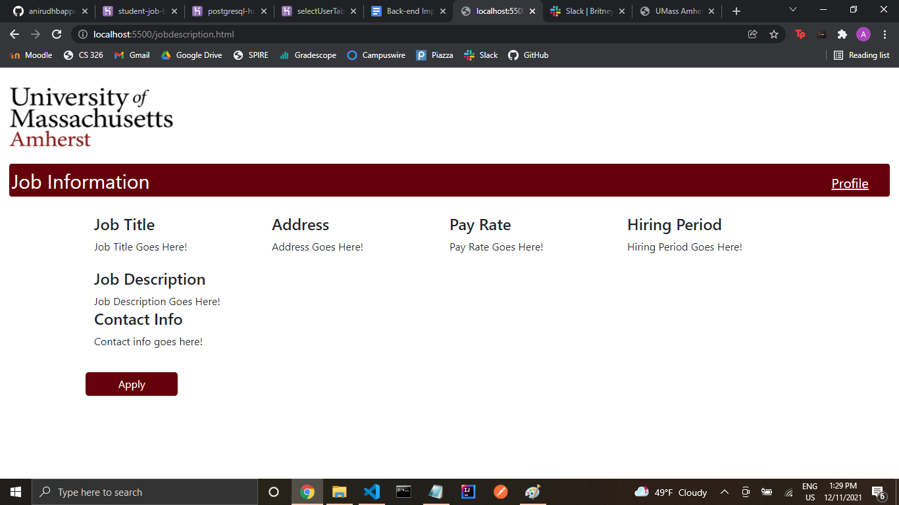
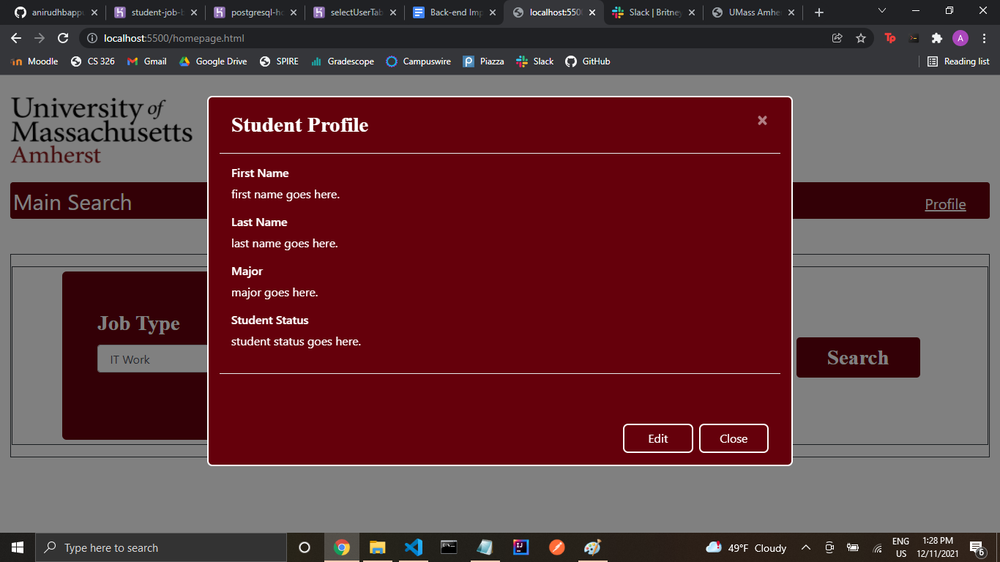

Heroku Link: https://student-job-board-tet.herokuapp.com/

Title: 
Team Tet

Subtitle: 
student-job-board-tet

Semester: 
Fall 2021

Overview: 
This application was meant to be a portal for students to log in to in order to get results of a job best suited for their needs and wants whether it is on campus or off campus. The student would have been able to set their profile in order to quick apply to a job that they are interested in by having an automatically filled form that would take the information from the profile of the student and send it to the employer.

Team Members: 
Anjali Arigela -- aarigela9 
Ariel S. Lutati  -- ariel42700
Anirudh Tale -- anirudhbappu

User Interface: 
1. Login -- The first page is a login page. This page is where the student will be able to enter their information, or if they do not have user credentials already, they will have the option to register.
 
2. Register -- If you click on the register prompt, another page will be rendered where the student will be able to enter their credentials that they want and if they are available, they will be redirected to the login, else they will have to enter different credentials.
 
3. Main Search -- The main search page is where the student can select which options they like and based on the query that is generated from these options, a popup will show up.
 
4. Job Results Popup -- The Job Results popup shows all the jobs that will show a table of all the jobs generated from the search. The student will be able to click on the link in order to get whatever job they clicked's full description.
 
5. Job Description -- The Job Description Page includes all the information about a specific given job.
 
6. Profile -- There is also a profile page in which student profiles will show up in a popup.
 

APIs: 

/getListJobs --> this endpoint will get a list of jobs based on the input from the user as to what criteria they would like their job to have such as if it workstudy or not or if it is on campus or not and the job type such as waitress or IT support, etc. --> select from the database

/getJobDes --> this endpoint will get the specific job details that are stored for a job that a user is interested in from the list of jobs generated from their search --> information would include job title, job description, job address, etc. --> select from the database

/getProfile --> this endpoint will allow a user, when they login, to use their profile details to quick apply to jobs that they are interested in --> select from the database

/setProfile --> this endpoint will allow a user, once logged in, to update their profile information so that they would be able to later get the information to quick apply to jobs --> update the database

/register --> this will check the username and password in the user tables to see if any records have the same information for the student or the same login informaiton --> checking whether or not they can register with preferred credentials

//login -->
/getUser --> this endpoint will get the specific user details if they are already registered on the website or it will prompt to create a new user in the database --> select from database

/validatePassword --> this endpoint will authenticate whether or not the password with the specific user is what is stored in the database --> select from database

Database: 

In the database, we have two tables in which one is containing all of the job information. And the second is containing the user information and the student information. We were able to connect to the database, however, we were having difficult displaying those results on our actual pages on our application.

Table Name: userTable
| Column       | Data Type                  | Description              |
|--------------|--------------------------- |--------------------------|
| StudentID    | int NOT NULL Primary Key   | Spire ID of student      |
| firstName    | varchar (255)              | Student first name       |
| lastName     | varchar (255)              | Student last name        |
| major        | varchar (255)              | Student major            |
| userName     | varchar (255)              | Student username         |
| password     | varchar (255)              | Student password         |

Table Name: jobsTable
| Column       | Data Type                  | Description              |
|--------------|--------------------------- |--------------------------|
| JobID        | int NOT NULL Primary Key   | Job Id -- random integer |
| jobTitle     | varchar (255)              | Job Title                |
| workingPeriod| varchar (255)              | Which time of Year Job Is|
| hoursPerWeek | int                        | How many hours per week  |
| jobRating    | int                        | How job has been rate    |
| employerName | varchar (255)              | Employer Name            |
| employerEmail| varchar (255)              | Employer Email           |
| jobStreet    | varchar (255)              | Job Street               |
| jobTown      | varchar (255)              | Job Town                 |
| jobZipCode   | int                        | Job Zip Code             |
| jobLocation  | varchar (255)              | On Campus or Off Campus  |

URL Routes/Mappings: 
See server.js file.

Authentication/Authorization: 
We were not able to get authentication done for this project.

Division of Labor: 
We were all equally able to divide the work through meetings and collaborations.

Conclusion: 
This app, although having a simple design, was difficult to complete given some circumstances throughout the semester. We have all definitely learned a lot through constructing this app and we especially had fun learning new techniques to get the app functioning. Using heroku and express were very good highlights that we think will be very useful in the future. Although we are disappointed we were not able to finish the project to the fullest extent, we believe we worked very hard to get the application to what it is at right now. If we had more time, we would have been able to finish it for sure. We struggled with this throughout the semester as well as other circumstances that led us to some troubles with communication. Though, we were still able to work together to finish the app to whatever it got to at this point.