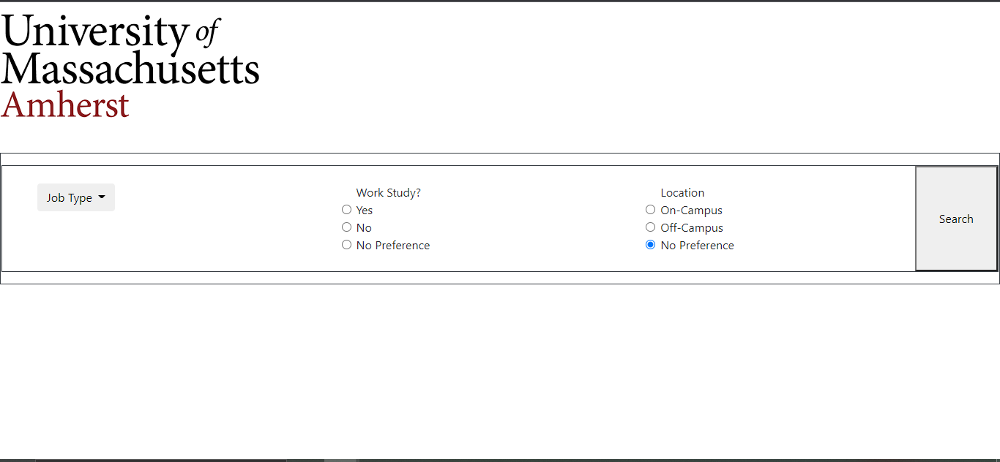
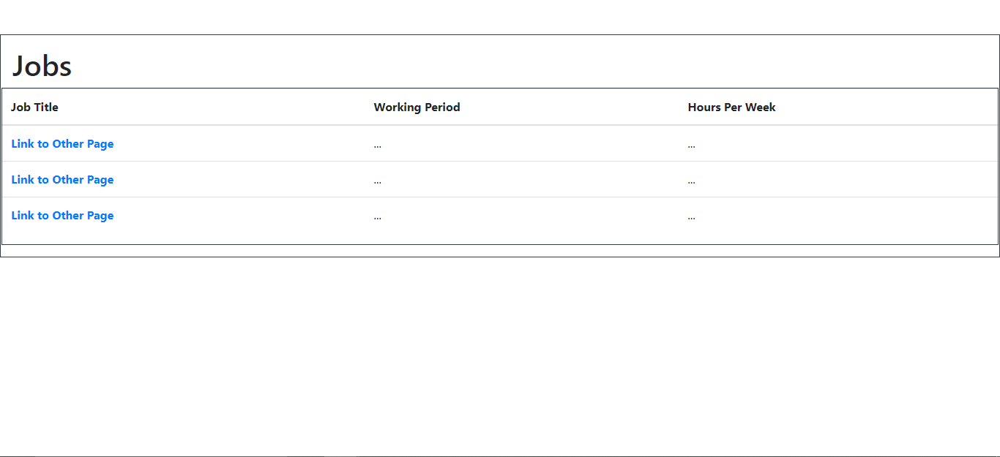
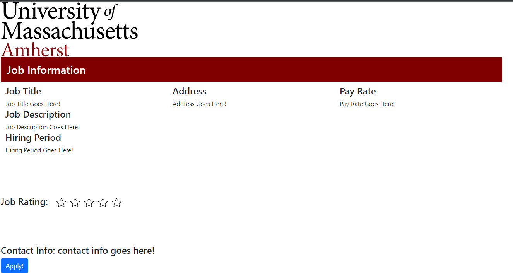

For this milestone, we had some difficulties in terms of a team member's computer having issues as well as other issues that I will not mention for personal reasons. In the repo, we have started some code for the server.js where we have started to implement the dummy server. There is also the API that has been completed but some issues on client-side. In terms of testing the dummy server, we were not able to install express as Windows was giving us issues, and we were not able to get the help needed to get the issue fixed. Therefore, we were not able to provide the screenshots or the Heroku Application URL. We are however going to meet this week and get the express issue fixed and consistently push to git the changes we have as soon as we are able to fix these issues.

Division of Labor:
Ariel -- API and Front-End Implementation -- had some issues with computer, wasn't able to finish everything
Anirudh -- Backend Dummy Server and Faker Data -- worked on figuring out the faker data and help with the backend dummy server
Anjali -- Backend Dummy Server and and Heroku and markdown-- issues with express and curl statements, so wasn't able to test or get the Heroku URL but will follow up this week and push changes as soon as able 

Components:

API Endpoints:

/getListJobs --> this endpoint will get a list of jobs based on the input from the user as to what criteria they would like their job to have such as if it workstudy or not or if it is on campus or not and the job type such as waitress or IT support, etc.

/getJobDes --> this endpoint will get the specific job details that are stored for a job that a user is interested in from the list of jobs generated from their search --> information would include job title, job description, job address, etc.

/getUser --> this endpoint will get the specific user details if they are already registered on the website or it will prompt to create a new user in the database

/validatePassword --> this endpoint will authenticate whether or not the password with the specific user is what is stored in the database

/getProfile --> this endpoint will allow a user, when they login, to use their profile details to quick apply to jobs that they are interested in

/setProfile --> this endpoint will allow a user, once logged in, to update their profile information so that they would be able to later get the information to quick apply to jobs

Again, we are still getting the hang of using endpoints and testing in the server, so we have not been able to fully test these yet, but this is our plan and this is what we will do. We do not have screenshots of this working currently, but we do have screenshots of the pages which will implement the endpoints. This is explained below:

API Front-End Implementation:

 
--> This page is where we will be implementing the /getJobList endpoint. We will do this by creating a query based on the inputs of the form that is on the page and then we will go through the database table which contains all of the jobs and the information related and we will filter out the jobs that match the user's criteria needed that is present in the query. This page is also acting as the home page where we will have a button in the top right hand corner that will allow a user to login. A popup will show up once login is clicked and /getUser and /validate Password will both be called once a user tries to login. This has not been implemented fully, yet but we will have it done soon. If the user does not exist in the database, a new popup will come up saying that it is not a registered login/password and they will have the option to retry or to register in which /getUser will be used but to insert the user and password and then they will be redirected, if success, to the login page again where they have to use their new credentials. 

--> This page is where we will be posting the results of the search in the database with the query of the requirements needed from the user. The result will be a table that will be a part of the popup that will include only some of the information stored for each job in the table as columns such as job title, working hours, and working period (such as in the fall or spring or summer). The Job Title column will consist of href links that will allow the user to select the job that they are interested in which will lead to the next endpoint.

--> This page is where the result of /getJobDes will show up. After the user clicks on an href link that shows up in the jobListTable, the specific details of the job will be shown on this page. The apply button, when clicked, will call another popup page which will be done soon, which will contain an html form with all of the information that is in the user's profile that is the result of the endpoint /getProfile. If the user has not filled out anything in their profile yet, they will be able to go to the top right hand corner of the page and click on their user icon and click on profile (all which will be implemented soon), and there they will be allowed to set all the information that is necessary in their profile, including uploading their resume which will be saved in the database through /setProfile for the specific user. If the profile is already complete of the user, then when the apply button is clicked, there will be a form in which contains all of the information from their profile as well as their resume if uploaded and this will be sent to the employer's contact email through an application template. If there is anything the user would like to add, they will be able to edit the email and they can manually send it once satisfied with what is written. The email template will be implemented, but is not shown currently.

Heroku Deployment:

https://student-job-board-final.herokuapp.com/ 
-->This is our link that is deploying our git code to our heroku app. Currently, there are some errors, but this will be fixed soon.
