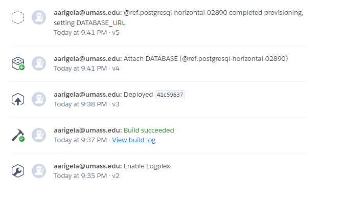

Milestone 3:

DIVISION OF LABOR:
We are equally contributed to the creation of the postgres tables in heroku as well as making changes to the server.js files and html files and we were able to determine the logic of each of the endpoints. We were able to get some code down for the connection to the database, however we are still having issues with our application link not working so we were not able to test it entirely.

ISSUES FOR THIS MILESTONE:
Although we were able to have multiple deploys on our application on heroku, our link is still not working. We will fix this issue this week and continue to deploy and push to github. 
 

DATABASE COMPONENT:

These are the database tables we currently have in heroku postgres.

Table Name: userTable
| Column       | Data Type                  | Description              |
|--------------|--------------------------- |--------------------------|
| StudentID    | int NOT NULL Primary Key   | Spire ID of student      |
| firstName    | varchar (255)              | Student first name       |
| lastName     | varchar (255)              | Student last name        |
| major        | varchar (255)              | Student major            |
| userName     | varchar (255)              | Student username         |

Table Name: jobsTable
| Column       | Data Type                  | Description              |
|--------------|--------------------------- |--------------------------|
| JobID        | int NOT NULL Primary Key   | Job Id -- random integer |
| jobTitle     | varchar (255)              | Job Title                |
| workingPeriod| varchar (255)              | Which time of Year Job Is|
| hoursPerWeek | int                        | How many hours per week  |
| jobRating    | int                        | How job has been rate    |
| employerName | varchar (255)              | Employer Name            |
| employerEmail| varchar (255)              | Employer Email           |
| jobStreet    | varchar (255)              | Job Street               |
| jobTown      | varchar (255)              | Job Town                 |
| jobZipCode   | int                        | Job Zip Code             |
| jobLocation  | varchar (255)              | On Campus or Off Campus  |

FUNCTIONS FOR CRUD OPERATIONS COMPONENT:

These are the endpoint templates we will be using to access the database tables and send queries that will allow us to get data and add data to the database for userTable. There is no adding to the jobsTable as this is only done from the admin side and no user will be able to modify the contents of this table.
GET — / | getJobs()
GET — / | getUsers()
GET — /users/:id | getProfileById()
POST — register| register()
PUT — /users/:id | updateProfileById()

const getJobs = (request, response) => {
  let query_jobType = request.body.jobType;
  let query_location = request.body.location;
  let query_jobType = request.body.workStudy;
  pool.query('SELECT * FROM jobsTable where (input the query results here)', (error, results) => {
    if (error) {
      throw error
    }
    response.status(200).json(results.rows)//all of the results will be sent to the server
  })
}

const getUsers = (request, response) => {
  let userId = request.body.userName;//getting the student’s userName entered in the login
  //take the userId and check if in database
  //if not in database → set router to the register page 
  //if in database, validate the password that is entered by checking secrets.json and the user
  //if correct login, change the page to include profile details
  //if incorrect login, change the page to include the wrong credentials page
}

const getProfileById = (request, response) => {
  let userId = request.body.StudentID;
  //when the apply button is clicked, the student id associated with the user which should be the primary key in the table will be the query result to insert in the statement below that will take each column value for that student’s profile and insert it into the form fields
  pool.query('SELECT * FROM userTable where (input the query results here)', (error, results) => {
    if (error) {
      throw error
    }
    response.status(200).json(results.rows)//all of the results will be sent to the server
  })
}

const updateProfileById = (request, response) => {
  let userId = request.body.userName;
  let updatedFields = [];//this array will contain a list of objects that contains the id related to the input in the profile page form and will contain the updated value as the key value pair
  //for each object in the array, there will be an update statement that will go ahead and create an update query statement that will run and update the key in the object with the value for that key
  pool.query((insert query here)', (error, results) => {
    if (error) {
      throw error
    }
    response.status(200).json(results.rows)//all of the results will be sent to the server
  })
}
